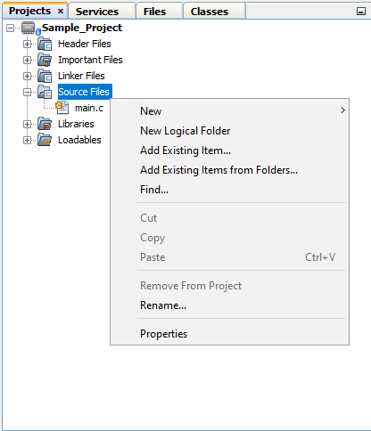
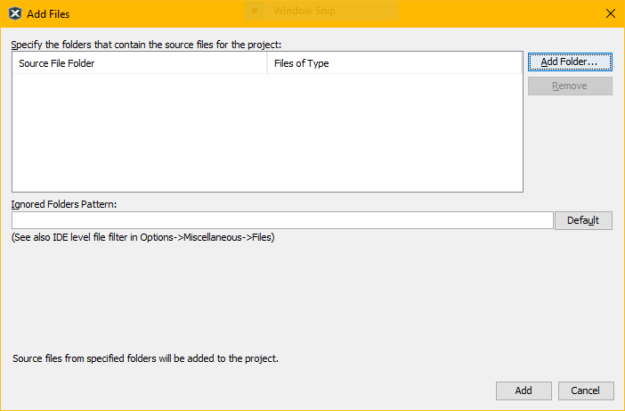
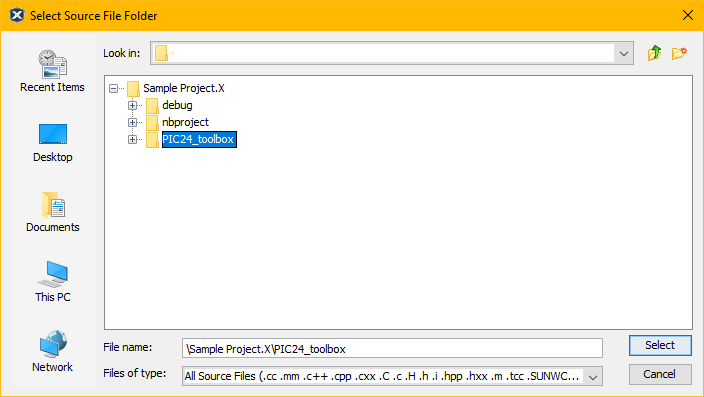
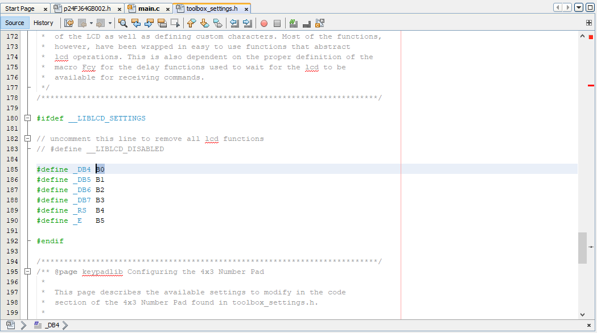
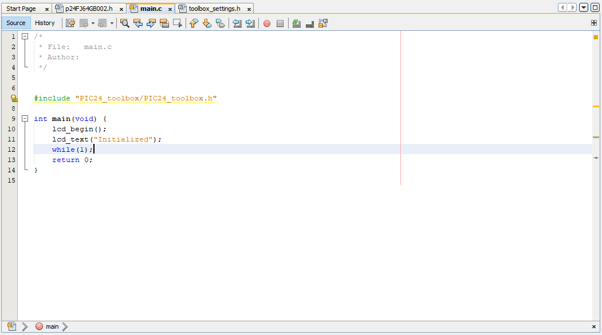

# PIC General Usage Toolbox

This is a collection of libraries that can be used for PIC microcontroller programming.
The library is designed to be compatible for the MPLab X IDE using the XC16 compiler.
Simply include the header [PIC24_toolbox.h](PIC24_toolbox.h) to use various libraries available to it such as:

- *delay_us()*, *delay_ms()*, and *delay_s()* which take delay values in microseconds, milliseconds, and seconds respectively.
- various function for interfacing with generic 16x2 character lcd modules

## Usage

1. Clone the repository (or download from the releases). Copy this folder to the root directory of your MPLAB X IDE project.
2. Right click the *Source Files* folder of your project and click *Add Existing Items from Folders...  

3. A window will appear. Click the *Add Folder...* button to select the folder.  

4. Make sure to set the *Files of type:* option to *All Source Files* and add this folder.  

5. Back to the previous window, click the *Add* button. The whole folder should be in the *Source Files* tree.
6. Modify [toolbox_settings.h](utilities/toolbox_settings.h) settings such as pin assignments, instruction cycle frequency, and other values.  

7. Add [PIC24_toolbox.h](PIC24_toolbox.h) to all the files that would be using the library.  

8. ???
9. Profit

## Configuration

Certain macros need to be configured for certain parts of the library to work.
All macros to be configured lies in the header file [toolbox_settings.h](utilities/toolbox_settings.h).
This header file is included by other C code in the library to use their respective configuration blocks.
It also uses and includes **xc.h** and **libpic30.h** libraries from the XC16 compiler to improve compatibility with all 16-bit PIC microcontrollers.
